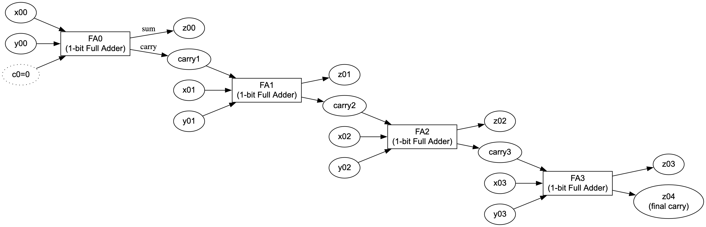

### Problem:
You're in a jungle grove where a monitoring device processes binary numbers through boolean gates. The system has inputs (`x` and `y` wires), gates (e.g., AND, OR, XOR), and outputs (`z` wires). The device should correctly perform addition of two binary numbers (`x` + `y`) and output the result on `z` wires in binary. However, the device is malfunctioning due to swapped output wires in four pairs of gates.

### Tasks:

1. **Part One**: es.usj.day24.LogicGateSimulation
   Simulate the gates and wires as described. Compute the decimal value represented by the binary number on the `z` wires. Example:
    - Binary on `z` wires: `100` → Decimal: `4`.

2. **Part Two**: es.usj.day24.ParallelSuspectSwapper
   Determine which four pairs of gates have swapped outputs. Fix the swaps so the device correctly performs binary addition. For example:
    - Swapped outputs: `z00,z01,z02,z05`.
    - After fixing, ensure the system outputs the correct binary sum.

Simplified view of the input:

---

### Key Details:

1. Gates process values using boolean logic:
    - **AND**: Outputs 1 if both inputs are 1; otherwise 0.
    - **OR**: Outputs 1 if at least one input is 1; otherwise 0.
    - **XOR**: Outputs 1 if inputs differ; otherwise 0.

2. Input wires (`x` and `y`) define binary numbers.
    - Example: `x00: 1, x01: 0` represents `10` (binary).

3. Output wires (`z`) represent the result in binary.
    - Example: `z00: 0, z01: 1` → Decimal: `2`.

4. Four pairs of gate outputs are swapped, causing incorrect results. Identifying and fixing these swaps restores proper operation.

### Simplified Goal:
Simulate the system, identify the swapped pairs, fix them, and output the sorted list of swapped wires as a comma-separated string.

Example final answer format:  
`aaa,aoc,bbb,ccc,eee,ooo,z24,z99`